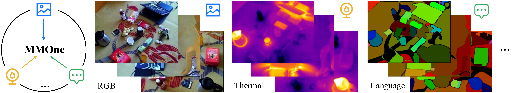

# MMOne: Representing Multiple Modalities in One Scene (ICCV 2025)

This is the official implementation of **MMOne**.

**MMOne: Representing Multiple Modalities in One Scene** <br />
Zhifeng Gu and Bing Wang <br />
**[[Paper](https://arxiv.org/pdf/2507.11129)]** <br />

<p align="center"> 
   
</p>


## Installation
This code has been tested with Python 3.7, torch 1.12.1, CUDA 11.6.

- Clone the repository 
```
git clone git@github.com:Neal2020GitHub/MMOne.git
cd MMOne
```
- Create conda environment
```
conda env create -f environment.yml
conda activate mmone
```


## Datasets
Download the datasets: [RGBT-Scenes](https://github.com/chen-hangyu/Thermal-Gaussian-main), [LERF](https://github.com/minghanqin/LangSplat).


### Convert RGBT-Scenes to 3DGS Format

To reorganize RGBT-Scenes into the standard 3DGS dataset structure:
```
python convert_rgbt.py --path <path to RGBT-Scenes>
```
After conversion, the dataset should be structured as:
```
<location>/
|---images/
|   |---<image 0>
|   |---<image 1>
|   |---...
|---thermal/
|   |---<thermal 0>
|   |---<thermal 1>
|   |---...
|---sparse/
    |---0/
        |---cameras.bin
        |---images.bin
        |---points3D.bin
```

### Generate Language Features

We follow the pipeline of [LangSplat](https://github.com/minghanqin/LangSplat) to extract language features, train autoencoders, and obtain lower-dimensional features. After processing, the dataset should include:
```
<location>/
|---language_feature/
|   |---00_f.npy
|   |---00_s.npy
|   |---...
|---language_feature_dim3/
|   |---00_f.npy
|   |---00_s.npy
|   |---...
```


## Training & Evaluation

### (1) RGB-Thermal
```
python train.py -s data/RGBT-Scenes/Dimsum -m output/R-T/Dimsum --eval --rgb_thermal --thermal_density

python render.py -m output/R-T/Dimsum --rgb_thermal --thermal_density

python metrics.py -m output/R-T/Dimsum
```


### (2) RGB-Language
```
python train.py -s data/lerf/figurines -m output/R-L/figurines/figurines --eval --include_language --language_density --feature_level 2

python render.py -m output/R-L/figurines/figurines_2 --include_language --language_density

python metrics.py -m output/R-L/figurines/figurines_2
cd eval
sh eval.sh
```


### (3) RGB-Thermal-Language
```
python train.py -s data/RGBT-Scenes/Dimsum -m output/R-T-L/Dimsum --eval --rgb_thermal --thermal_density --include_language --language_density --feature_level 2

python render.py -m output/R-T-L/Dimsum_2 --rgb_thermal --thermal_density --include_language --language_density

python metrics.py -m output/R-T-L/Dimsum_2
cd eval
sh eval_rgbt.sh
```


## Acknowledgements
This project builds upon [3DGS](https://github.com/graphdeco-inria/gaussian-splatting), [ThermalGaussian](https://github.com/chen-hangyu/Thermal-Gaussian-main) and [LangSplat](https://github.com/minghanqin/LangSplat). We sincerely thank the authors for their open-source contributions.


## Citation
```
@InProceedings{Gu_2025_ICCV,
    author    = {Gu, Zhifeng and Wang, Bing},
    title     = {MMOne: Representing Multiple Modalities in One Scene},
    booktitle = {Proceedings of the IEEE/CVF International Conference on Computer Vision (ICCV)},
    month     = {October},
    year      = {2025},
    pages     = {1088-1098}
}
```
